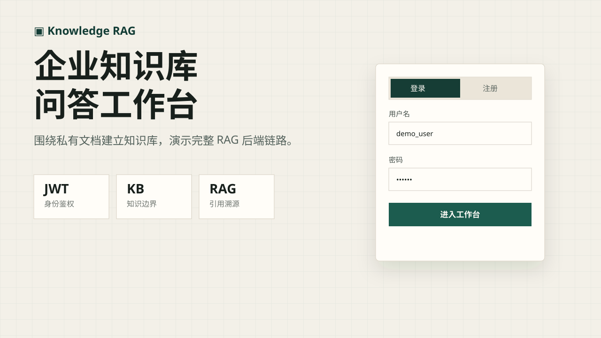
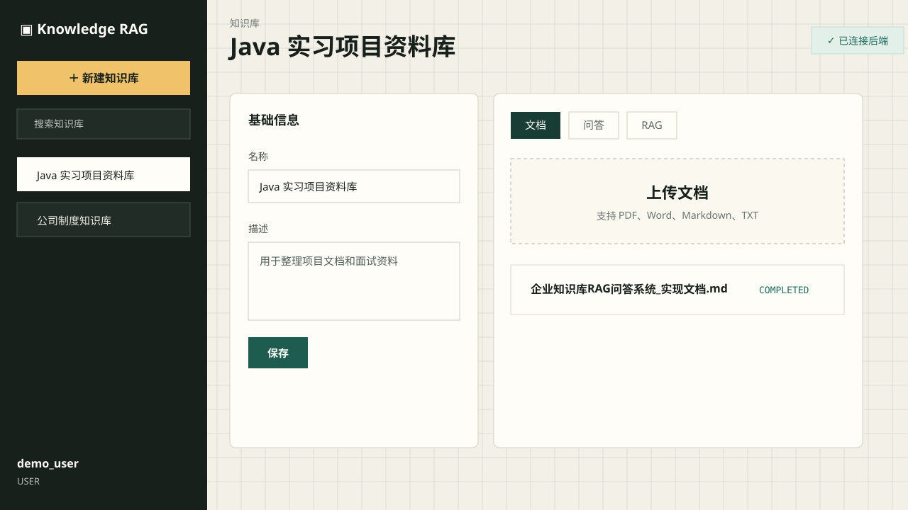
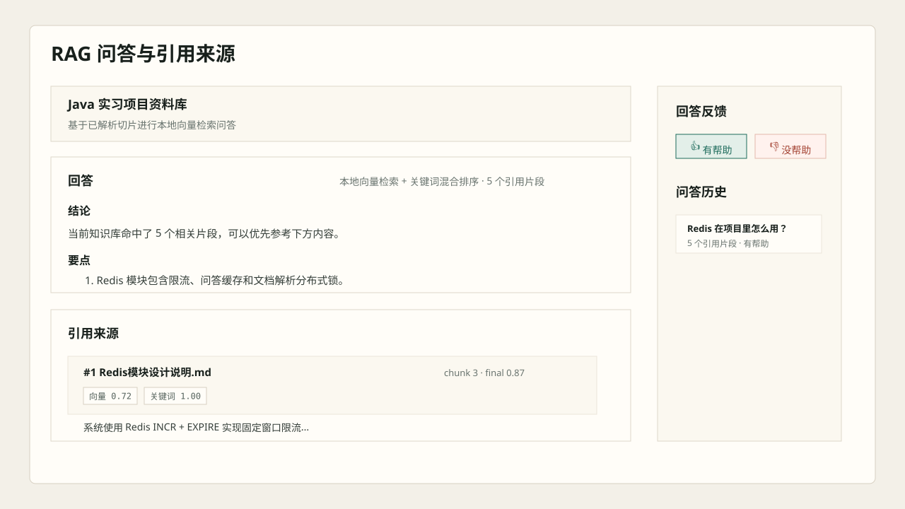
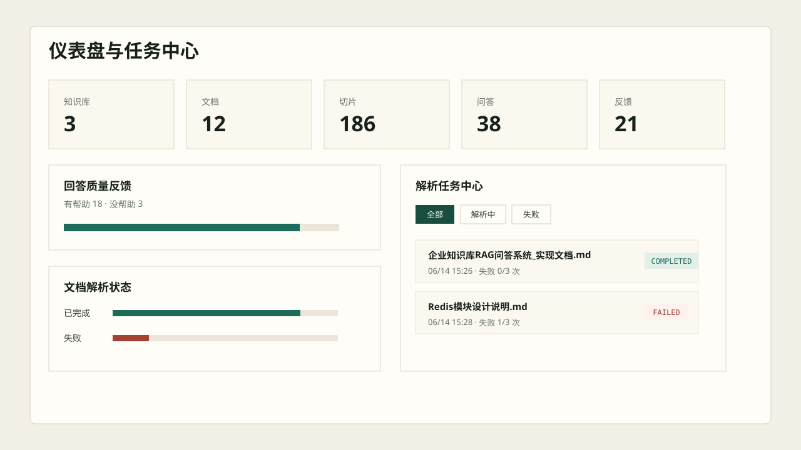
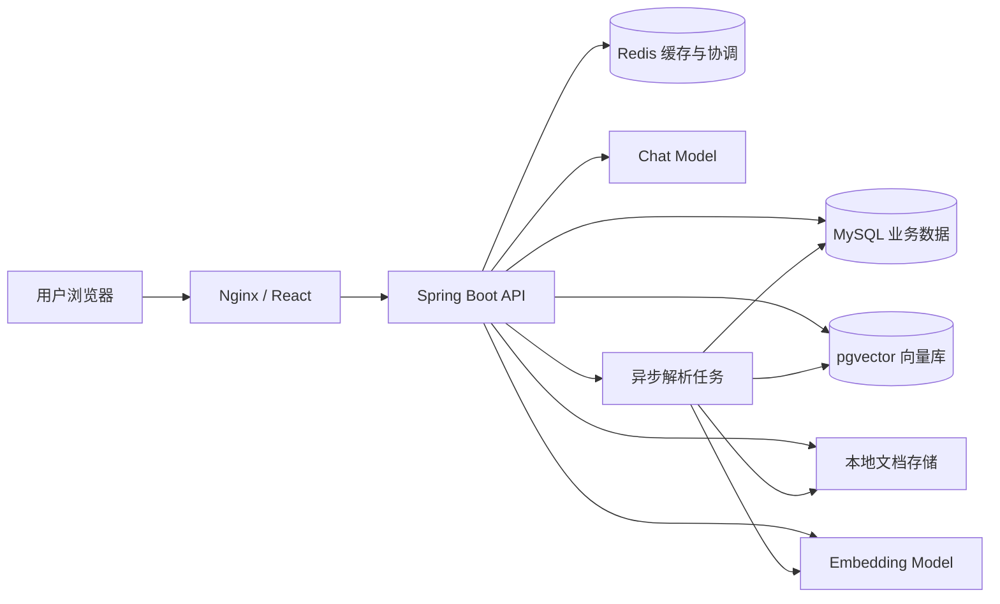
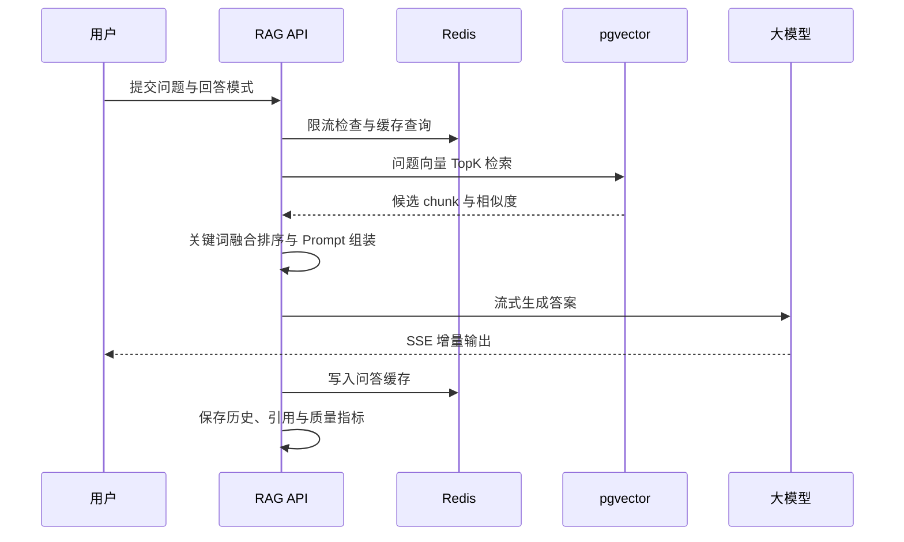

# 企业知识库 RAG 问答系统

面向企业私有文档的全栈 RAG 知识库平台。系统覆盖文档入库、异步解析、向量化、混合检索、流式问答、引用溯源、质量评测与运行监控，并提供可直接部署的 Docker 生产方案。

<p>
  
  
  
  
  
  
</p>

## 界面预览

<table>
  <tr>
    <td width="50%" align="center"><strong>登录与注册</strong></td>
    <td width="50%" align="center"><strong>知识库工作台</strong></td>
  </tr>
  <tr>
    <td></td>
    <td></td>
  </tr>
  <tr>
    <td width="50%" align="center"><strong>流式问答与引用溯源</strong></td>
    <td width="50%" align="center"><strong>任务中心与系统监控</strong></td>
  </tr>
  <tr>
    <td></td>
    <td></td>
  </tr>
</table>

## 核心能力

- **完整 RAG 链路**：上传文档、解析清洗、chunk 切分、Embedding、TopK 召回、Prompt 组装、流式生成与引用落库。
- **真实模型接入**：兼容 OpenAI API 协议，可接入 DeepSeek 等聊天模型以及阿里云百炼 Embedding 模型。
- **向量检索**：支持 pgvector 持久化与召回，并保留本地 Hashing Embedding 作为开发和故障降级方案。
- **混合排序**：融合向量相似度与关键词命中分数，支持 TopK、候选扫描上限和权重配置。
- **引用可解释**：答案引用可点击定位对应 chunk，并展示来源、最终分数、向量分数和关键词分数。
- **三种回答模式**：严谨模式、简洁模式、面试模式，可结合知识库级 Prompt 模板调整输出策略。
- **异步文档任务**：PDF、DOC、DOCX、Markdown、TXT 异步解析，包含进度轮询、状态机、失败重试和任务日志。
- **企业级权限**：JWT 登录鉴权、管理员后台、知识库成员与 `OWNER / ADMIN / EDITOR / VIEWER` 权限模型。
- **Redis 工程能力**：问答缓存、固定窗口限流、分布式锁、解析进度、热点问题和 Token 黑名单。
- **质量闭环**：问答历史、用户反馈、质量问题统计、评测数据集与批量评测运行。
- **可观测性**：健康检查、今日指标、运行配置诊断、组件状态和任务中心。
- **生产部署**：前后端多阶段镜像，MySQL、Redis、pgvector 编排，健康检查、日志轮转和宝塔反向代理方案。

## 系统架构



## RAG 运行流程



## 技术栈

| 模块 | 技术 |
|---|---|
| 后端 | Java 21、Spring Boot 3.3.5、Spring MVC、MyBatis-Plus |
| 鉴权与权限 | JWT、BCrypt、拦截器、RBAC |
| 业务数据库 | MySQL 8.4 |
| 缓存与协调 | Redis 7、Lua、分布式锁、限流、缓存 |
| 向量能力 | pgvector、Cosine Similarity、混合检索 |
| 模型接入 | OpenAI-compatible Chat / Embedding API |
| 文档解析 | PDFBox、Apache POI、Java NIO |
| 异步任务 | Spring Async、数据库任务队列、失败重试 |
| 前端 | React、TypeScript、Vite、Lucide Icons |
| API 文档 | Knife4j、OpenAPI 3 |
| 部署 | Docker、Docker Compose、Nginx、宝塔面板 |
| 测试 | JUnit 5、Mockito、Spring Boot Test |

## 功能模块

| 模块 | 主要功能 |
|---|---|
| 认证中心 | 注册、登录、JWT、退出黑名单、个人资料、修改密码、登录日志 |
| 知识库 | CRUD、成员管理、角色权限、备份导入导出、级联清理 |
| 文档中心 | 多格式上传、异步解析、chunk 预览、质量报告、索引同步 |
| RAG 问答 | SSE 流式输出、三种回答模式、引用跳转、历史会话、热点问题 |
| 检索调试 | 召回 chunk、分数组成、命中词、高亮内容与排序解释 |
| 任务中心 | 任务筛选、解析进度、失败原因、单条与批量重试、任务日志 |
| 质量评测 | 评测用例、批量运行、命中率、引用率、延迟与质量问题统计 |
| 系统监控 | 组件健康、今日指标、运行配置、诊断建议和缓存状态 |
| 管理后台 | 用户启停、密码重置、登录审计和管理员操作日志 |

## 快速启动

### 环境要求

- Docker 26+
- Docker Compose v2
- 至少 2 GB 可用内存

### 1. 准备环境变量

```bash
cp .env.production.example .env
```

编辑 `.env`，至少配置数据库、JWT、聊天模型和向量模型密钥。`.env` 已被 Git 忽略，不应提交到仓库。

### 2. 启动服务

本地开发编排：

```bash
docker compose up -d --build
```

生产编排：

```bash
docker compose --env-file .env -f docker-compose.prod.yml up -d --build
```

### 3. 访问系统

| 服务 | 地址 |
|---|---|
| 前端工作台 | `http://localhost:5173` |
| 后端健康检查 | `http://localhost:8080/api/health` |
| Knife4j 文档 | `http://localhost:8080/doc.html` |

生产环境只需暴露前端反向代理端口，MySQL、Redis、pgvector 和后端均保持在容器内部网络。

## 模型配置

系统默认兼容 OpenAI 风格接口，以下为环境变量示例：

```dotenv
CHAT_MODEL_ENABLED=true
CHAT_MODEL_BASE_URL=https://api.deepseek.com
CHAT_MODEL_ENDPOINT_PATH=/v1/chat/completions
CHAT_MODEL_API_KEY=replace-with-your-api-key
CHAT_MODEL_NAME=replace-with-your-chat-model

EMBEDDING_MODEL_ENABLED=true
EMBEDDING_MODEL_BASE_URL=https://dashscope.aliyuncs.com/compatible-mode/v1
EMBEDDING_MODEL_ENDPOINT_PATH=/embeddings
EMBEDDING_MODEL_API_KEY=replace-with-your-api-key
EMBEDDING_MODEL_NAME=text-embedding-v4
EMBEDDING_MODEL_DIMENSIONS=1024

PGVECTOR_ENABLED=true
PGVECTOR_DIMENSIONS=1024
```

模型名称、向量维度和 pgvector 表维度必须保持一致。未启用外部 Embedding 时，系统可以回退到本地 Hashing Embedding，便于开发与演示。

## 项目结构

```text
knowledge-rag/
├─ src/main/java/com/rag/knowledge/
│  ├─ ai/              # 大模型客户端
│  ├─ controller/      # REST 与 SSE 接口
│  ├─ service/         # 业务服务与实现
│  ├─ vector/          # Embedding、pgvector 与检索路由
│  ├─ job/             # 异步解析任务与队列 Worker
│  ├─ repository/      # MyBatis-Plus Mapper
│  ├─ domain/          # 领域实体与枚举
│  ├─ dto/             # 请求与响应模型
│  └─ config/          # 模型、线程池和基础设施配置
├─ frontend/           # React + TypeScript 前端
├─ sql/init.sql        # MySQL 初始化脚本
├─ docs/               # 架构、部署与技术文档
├─ docker-compose.yml  # 本地开发编排
└─ docker-compose.prod.yml
```

## 测试与构建

```bash
# 后端测试
mvn test

# 前端生产构建
cd frontend
npm install
npm run build
```

当前测试覆盖鉴权拦截器、文本切分、文档读取、本地向量生成与检索、管理服务等核心逻辑。

## 技术文档

- [项目架构与流程图](docs/项目架构与流程图.md)
- [核心技术模块说明](docs/核心技术模块说明.md)
- [技术模块学习文档](docs/技术模块学习文档.md)
- [Redis 模块设计说明](docs/Redis模块设计说明.md)
- [大模型接入说明](docs/大模型接入说明.md)
- [Docker 一键启动说明](docs/Docker一键启动说明.md)
- [宝塔生产部署说明](docs/宝塔生产部署说明.md)
- [项目踩坑记录](docs/项目踩坑记录.md)
- [演示脚本](docs/演示脚本.md)

## 安全说明

- 所有模型密钥、数据库密码和 JWT Secret 均通过环境变量注入。
- 仓库仅提供 `.env.production.example`，不会提交真实 `.env`。
- 生产环境不应将 MySQL、Redis、pgvector 或后端端口直接暴露到公网。
- 首次部署后请创建独立管理员账号，并使用高强度密码。

## 后续计划

- 增加扫描版 PDF OCR 与表格结构化解析。
- 引入 reranker 提升复杂问题的召回精度。
- 增加端到端浏览器测试与持续集成流水线。
- 支持对象存储和多实例任务调度。
