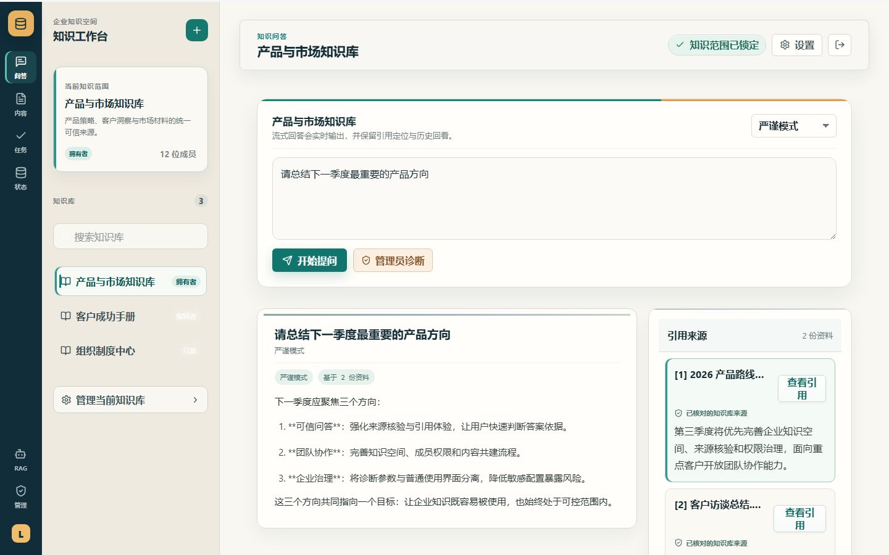
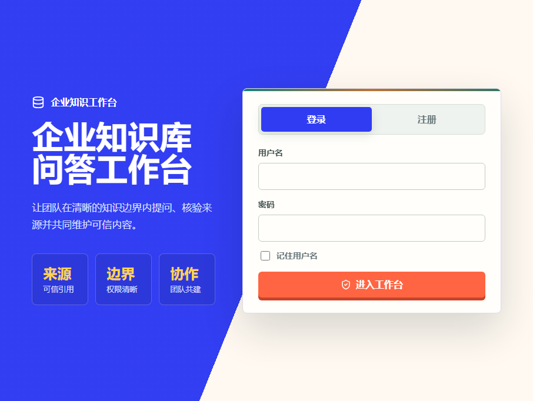
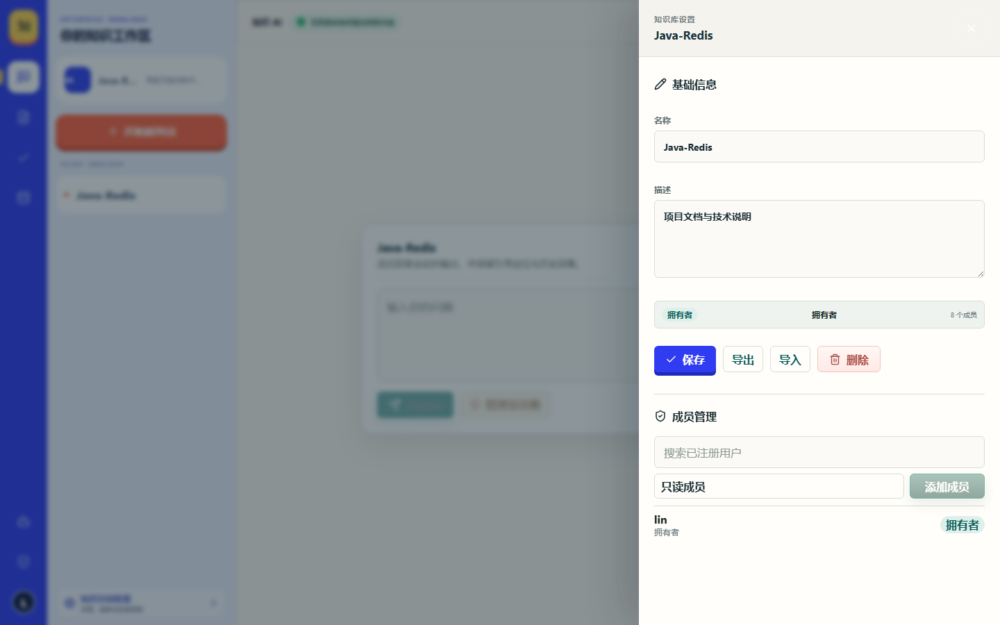
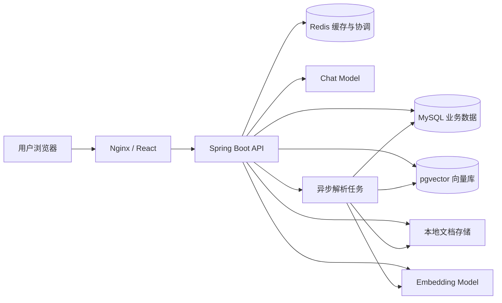
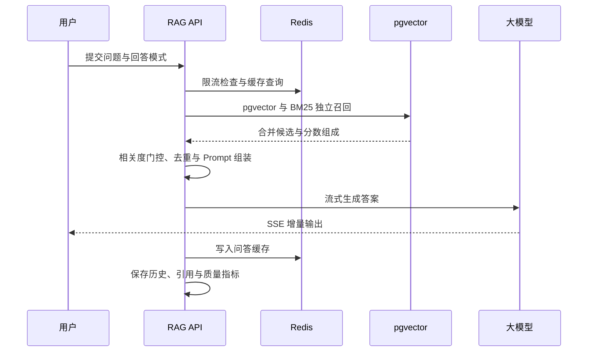

# 企业知识库 RAG 问答系统

一个面向团队私有知识的企业级全栈 RAG 问答平台。它不仅完成“上传文档—解析切片—向量检索—生成答案”的基础链路，还把知识权限、可信引用、质量评测、任务治理和运行诊断整合进同一套可部署的知识工作台。

产品以“先回答、再核验”为核心体验：普通用户专注于选择知识范围、提问和查验来源；内容管理员负责文档、成员与索引质量；系统管理员则通过独立控制台管理模型、缓存、任务和服务健康状态。项目可使用本地降级能力快速体验，也可接入 OpenAI-compatible Chat、Embedding API 与 pgvector 运行完整生产链路。

<p>
  
  
  
  
  
  
  <a href="https://github.com/20030713/knowledge-rag/actions/workflows/ci.yml"></a>
</p>

## 项目定位

- **可信问答入口**：流式生成答案，同时保留文档级引用与原文证据，帮助用户判断答案是否可信。
- **团队知识治理**：支持多知识库、成员协作、四级 RBAC 权限、备份迁移与知识范围隔离。
- **可调优 RAG 工程**：支持知识库级切片参数、混合召回、Prompt 模板、检索诊断和批量质量评测。
- **可落地部署**：提供 React + Spring Boot 前后端、MySQL、Redis、pgvector、Docker Compose、健康检查与自动化 CI。

## 界面预览

### 知识问答主工作台

靛蓝工具轨、珊瑚橙操作色、奶油白答案画布与深夜蓝证据舱构成新的界面系统。会话、回答和引用各自占据稳定区域，普通用户无需接触内部检索参数。



<table>
  <tr>
    <td width="50%" align="center"><strong>登录与注册</strong></td>
    <td width="50%" align="center"><strong>知识库设置抽屉</strong></td>
  </tr>
  <tr>
    <td></td>
    <td></td>
  </tr>
</table>

### 信息分层

- **普通使用层**：知识范围、问题输入、生成答案、可信引用和历史问答。
- **内容管理层**：文档上传、解析状态、知识库成员、权限与备份，集中在独立入口和设置抽屉。
- **管理员诊断层**：模型、缓存、延迟、chunk 编号和检索分数仅在管理员工具中按需展示。

## 核心能力

- **完整 RAG 链路**：上传文档、版面清洗、标题感知 chunk 切分、Embedding、混合召回、证据门控、Prompt 组装、流式生成与引用落库。
- **真实模型接入**：兼容 OpenAI API 协议，可接入 DeepSeek 等聊天模型以及阿里云百炼 Embedding 模型。
- **向量检索**：支持 pgvector 持久化与召回，并保留本地 Hashing Embedding 作为开发和故障降级方案。
- **混合检索与排序**：独立召回 pgvector 与 BM25 候选后合并排序，并通过相关度阈值、关键词覆盖和 MMR 式去重控制证据质量；Embedding 暂时不可用时仍可使用 BM25 检索。
- **可靠拒答**：资料与问题关联不足时在生成前拒答；模型主动判定资料不足时不返回误导性引用。
- **引用可解释**：普通界面以文档来源和引用原文帮助用户核验答案；chunk、向量分数和关键词分数仅在管理员诊断中展示。
- **三种回答模式**：严谨模式、简洁模式、面试模式，可结合知识库级 Prompt 模板调整输出策略。
- **异步文档任务**：PDF、DOC、DOCX、Markdown、TXT 异步解析，包含进度轮询、状态机、失败重试和任务日志。
- **企业级权限**：JWT 登录鉴权、管理员后台、知识库成员与 `OWNER / ADMIN / EDITOR / VIEWER` 权限模型。
- **Redis 工程能力**：问答缓存、固定窗口限流、分布式锁、解析进度、热点问题和 Token 黑名单。
- **质量闭环**：问答历史、用户反馈、质量问题统计、评测数据集与批量评测运行。
- **分层可观测性**：健康检查、运行配置、缓存状态与检索诊断集中在管理员工具，避免后台数据出现在日常问答界面。
- **生产部署**：前后端多阶段镜像，MySQL、Redis、pgvector 编排，健康检查、日志轮转和宝塔反向代理方案。

## 系统架构



## RAG 运行流程



## 技术栈

| 模块 | 技术 |
|---|---|
| 后端 | Java 21、Spring Boot 3.3.5、Spring MVC、MyBatis-Plus |
| 鉴权与权限 | JWT、BCrypt、拦截器、RBAC |
| 业务数据库 | MySQL 8.4 |
| 缓存与协调 | Redis 7、Lua、分布式锁、限流、缓存 |
| 向量能力 | pgvector、Cosine Similarity、混合检索 |
| 模型接入 | OpenAI-compatible Chat / Embedding API |
| 文档解析 | PDFBox、Apache POI、Java NIO |
| 异步任务 | Spring Async、数据库任务队列、失败重试 |
| 前端 | React、TypeScript、Vite、Lucide Icons |
| API 文档 | Knife4j、OpenAPI 3 |
| 部署 | Docker、Docker Compose、Nginx、宝塔面板 |
| 测试 | JUnit 5、Mockito、Spring Boot Test |

## 功能模块

| 模块 | 主要功能 |
|---|---|
| 认证中心 | 注册、登录、JWT、退出黑名单、个人资料、修改密码、登录日志 |
| 知识库 | CRUD、成员管理、角色权限、备份导入导出、级联清理 |
| 文档中心 | 多格式上传、异步解析、chunk 预览、质量报告、索引同步 |
| RAG 问答 | SSE 流式输出、三种回答模式、引用跳转、历史会话、热点问题 |
| 管理员诊断 | 召回 chunk、分数组成、命中词、高亮内容与排序解释，仅管理员按需访问 |
| 任务中心 | 任务筛选、解析进度、失败原因、单条与批量重试、任务日志 |
| 质量评测 | 评测用例、批量运行、命中率、引用率、延迟与质量问题统计 |
| 系统监控 | 组件健康、今日指标、运行配置、诊断建议和缓存状态 |
| 管理后台 | 用户启停、密码重置、登录审计和管理员操作日志 |

## RAG 质量评测

仓库内置一套可重复执行的中文评测语料，覆盖费用报销、故障处置和 RAG 工程规范三类知识，并包含应当拒答的问题。评测会同时统计答案关键词得分、检索命中率、MRR、引用精度、拒答准确率和平均延迟，避免只凭主观观感判断效果。

```powershell
.\scripts\seed-rag-evaluation.ps1 `
  -Token '<登录后获得的 JWT>' `
  -ShareWith '<需要共享的用户名>' `
  -RunEvaluation
```

脚本会创建独立评测知识库、上传并解析 `docs/evaluation-corpus` 中的三份文档、写入 15 条评测用例并运行批量评测。重复执行时会复用同名知识库和用例，适合在调整切片、召回或 Prompt 后进行回归比较。

## 快速启动

### 环境要求

- Docker 26+
- Docker Compose v2
- 至少 2 GB 可用内存

### 1. 准备环境变量

```bash
cp .env.production.example .env
```

编辑 `.env`，至少配置数据库、JWT、聊天模型和向量模型密钥。`.env` 已被 Git 忽略，不应提交到仓库。

### 2. 启动服务

本地开发编排：

```bash
docker compose up -d --build
```

生产编排：

```bash
docker compose --env-file .env -f docker-compose.prod.yml up -d --build
```

### 3. 访问系统

| 服务 | 地址 |
|---|---|
| 前端工作台 | `http://localhost:5173` |
| 后端健康检查 | `http://localhost:8080/api/health` |
| Knife4j 文档 | `http://localhost:8080/doc.html` |

生产环境只需暴露前端反向代理端口，MySQL、Redis、pgvector 和后端均保持在容器内部网络。

## 模型配置

系统默认兼容 OpenAI 风格接口，以下为环境变量示例：

```dotenv
CHAT_MODEL_ENABLED=true
CHAT_MODEL_BASE_URL=https://api.deepseek.com
CHAT_MODEL_ENDPOINT_PATH=/v1/chat/completions
CHAT_MODEL_API_KEY=replace-with-your-api-key
CHAT_MODEL_NAME=replace-with-your-chat-model

EMBEDDING_MODEL_ENABLED=true
EMBEDDING_MODEL_BASE_URL=https://dashscope.aliyuncs.com/compatible-mode/v1
EMBEDDING_MODEL_ENDPOINT_PATH=/embeddings
EMBEDDING_MODEL_API_KEY=replace-with-your-api-key
EMBEDDING_MODEL_NAME=text-embedding-v3
EMBEDDING_MODEL_DIMENSIONS=1024

PGVECTOR_ENABLED=true
PGVECTOR_DIMENSIONS=1024
```

模型名称、向量维度和 pgvector 表维度必须保持一致。未启用外部 Embedding 时，系统可以回退到本地 Hashing Embedding，便于开发与演示。

## 项目结构

```text
knowledge-rag/
├─ src/main/java/com/rag/knowledge/
│  ├─ ai/              # 大模型客户端
│  ├─ controller/      # REST 与 SSE 接口
│  ├─ service/         # 业务服务与实现
│  ├─ vector/          # Embedding、pgvector 与检索路由
│  ├─ job/             # 异步解析任务与队列 Worker
│  ├─ repository/      # MyBatis-Plus Mapper
│  ├─ domain/          # 领域实体与枚举
│  ├─ dto/             # 请求与响应模型
│  └─ config/          # 模型、线程池和基础设施配置
├─ frontend/           # React + TypeScript 前端
├─ sql/init.sql        # MySQL 初始化脚本
├─ docs/               # 架构、部署、技术文档与评测语料
├─ scripts/            # 评测数据初始化脚本
├─ docker-compose.yml  # 本地开发编排
└─ docker-compose.prod.yml
```

## 测试与构建

```bash
# 后端测试
mvn test

# 前端生产构建
cd frontend
npm install
npm run build
```

当前测试覆盖鉴权拦截器、文本清洗与切分、BM25 关键词评分、文档读取、本地向量生成与检索、管理服务等核心逻辑。

## 技术文档

- [项目架构与流程图](docs/项目架构与流程图.md)
- [核心技术模块说明](docs/核心技术模块说明.md)
- [技术模块学习文档](docs/技术模块学习文档.md)
- [Redis 模块设计说明](docs/Redis模块设计说明.md)
- [大模型接入说明](docs/大模型接入说明.md)
- [Docker 一键启动说明](docs/Docker一键启动说明.md)
- [宝塔生产部署说明](docs/宝塔生产部署说明.md)
- [项目踩坑记录](docs/项目踩坑记录.md)
- [演示脚本](docs/演示脚本.md)
- [RAG 评测语料与执行说明](docs/evaluation-corpus/README.md)

## 安全说明

- 所有模型密钥、数据库密码和 JWT Secret 均通过环境变量注入。
- 仓库仅提供 `.env.production.example`，不会提交真实 `.env`。
- 生产环境不应将 MySQL、Redis、pgvector 或后端端口直接暴露到公网。
- 首次部署后请创建独立管理员账号，并使用高强度密码。

## 后续计划

- 增加扫描版 PDF OCR 与表格结构化解析。
- 引入 reranker 提升复杂问题的召回精度。
- 增加端到端浏览器测试与持续集成流水线。
- 支持对象存储和多实例任务调度。
