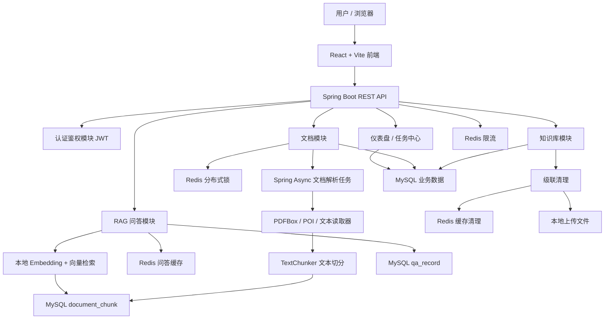
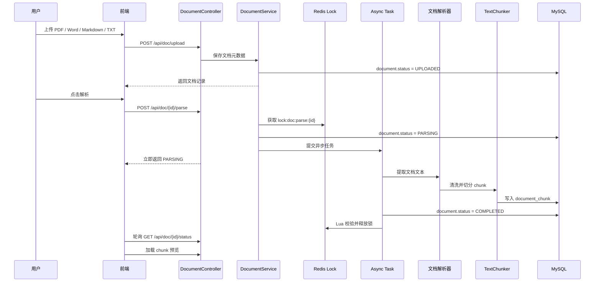
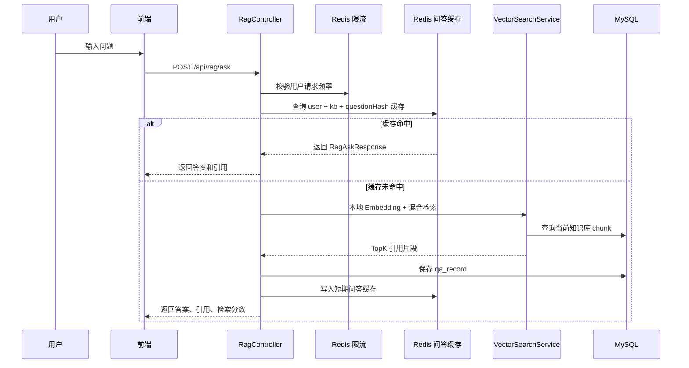
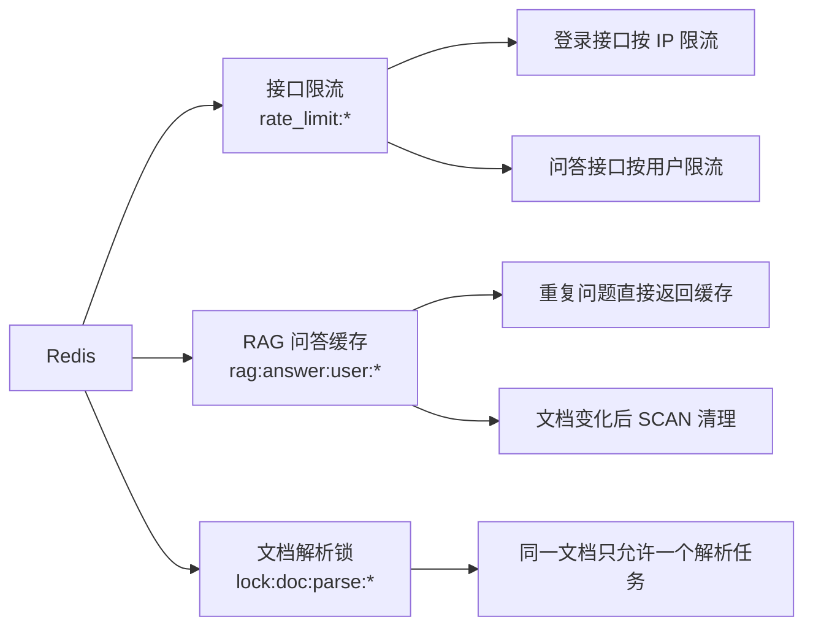
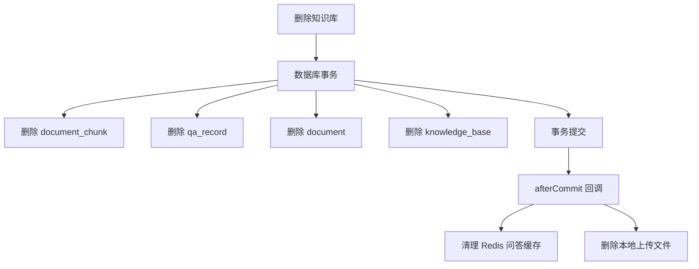

# 项目架构与流程图

本文档用于项目展示、答辩和面试讲解，重点说明系统边界、核心链路和模块协作关系。

## 1. 系统定位

企业知识库 RAG 问答系统不是普通聊天机器人，而是一个围绕“私有知识入库、检索、问答、引用、反馈”的完整后端项目。

核心目标：

- 用户可以维护自己的知识库
- 系统可以解析上传文档并生成文本切片
- 问答时只在当前知识库范围内召回片段
- 回答返回引用来源和检索分数
- 系统记录问答历史、任务状态和用户反馈
- Redis 参与限流、缓存和分布式锁

## 2. 总体架构

## 3. 核心业务边界

| 模块 | 职责 | 数据边界 |
|---|---|---|
| 用户认证 | 注册、登录、JWT 鉴权 | `user` |
| 知识库 | 创建、编辑、删除知识库 | `knowledge_base` |
| 文档 | 上传、解析、删除、状态流转 | `document` |
| 切片 | 保存解析后的 chunk | `document_chunk` |
| RAG 问答 | 检索、回答、引用、缓存 | `qa_record`, `document_chunk`, Redis |
| 任务中心 | 查询解析任务、失败重试 | `document.status` |
| 反馈闭环 | 保存回答质量反馈 | `qa_record.feedback_*` |
| Redis 工程增强 | 限流、缓存、分布式锁 | Redis |

## 4. 文档入库流程

## 5. RAG 问答流程

## 6. Redis 使用图

## 7. 数据一致性设计

关键点：

- 数据库内的数据用事务保证一致性
- Redis 和文件系统属于外部资源，放到事务提交后处理
- 外部资源清理失败只记录日志，后续可通过定时任务补偿

## 8. 当前技术亮点

- JWT 登录鉴权和用户级数据隔离
- 多格式文档解析：PDFBox + Apache POI + TXT/Markdown
- Spring Async 异步解析任务
- 文档状态机和失败重试保护
- Redis 固定窗口限流
- Redis RAG 问答缓存
- Redis `SET NX EX` + Lua 分布式锁
- 本地 Embedding + 向量检索抽象
- 向量分数 + 关键词分数混合排序
- 引用来源和检索分数透明展示
- 任务中心和失败任务重试
- 问答反馈闭环
- 知识库删除级联清理和事务 afterCommit
